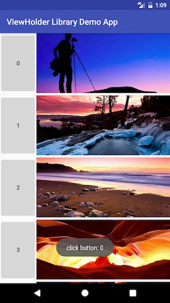

[](https://android-arsenal.com/api?level=7) </img> </img>

# The last ViewHolder

## Advantages

 * No need to create custom `RecyclerView.ViewHolder` anymore.
 * No need to create custom OnItemClickListener anymore, the only interface for click listener is:
 ```java
 public interface OnRecyclerViewItemClickListener extends View.OnClickListener {
    /**
     * @param holder The ViewHolder of the RecyclerView item.
     * @param position The position in which the item is clicked.
     */
    void onItemClick(ViewHolder holder, int position);

    /**
     * Note that the ViewHolder can be got by <code>v.getTag(R.id.tag_viewholder)</code>
     * or using SimpleOnRecyclerViewItemClickListener#getViewHolder
     */
    @Override
    void onClick(View v);
}
 ```
 * This may be the last ViewHolder class you would need.

## Download

```gradle

dependencies {
  compile 'com.ericluapp.android.libs:viewholder:1.0.0'
}

```

## Usage

```java
// No need to create any custom *ItemClickListener
private OnRecyclerViewItemClickListener mListener = new SimpleOnRecyclerViewItemClickListener() {
    @Override
    public void onItemClick(ViewHolder holder, int position) {
        Toast.makeText(MainActivity.this, "click item: " + position, Toast.LENGTH_SHORT)
                .show();
    }

    @Override
    public void onClick(View v) {
        ViewHolder holder = getViewHolder(v);
        switch (v.getId()) {
            case R.id.btn_button: {
                Toast.makeText(MainActivity.this, "click button: " + holder.getAdapterPosition(), Toast.LENGTH_SHORT)
                        .show();
                break;
            }
        }
    }
};

private static class MyAdapter extends RecyclerView.Adapter<ViewHolder> {

    private OnRecyclerViewItemClickListener mListener;

    public MyAdapter(OnRecyclerViewItemClickListener listener) {
        mListener = listener;
    }

    @Override
    public ViewHolder onCreateViewHolder(ViewGroup parent, int viewType) {
        // mListener: the item click listener.
        return new ViewHolder(R.layout.item_simple, parent, mListener);
    }

    @Override
    public void onBindViewHolder(ViewHolder holder, int position) {
        holder.setText(R.id.btn_button, position + "");
        // mListener: the view click listener.
        holder.setOnClickListener(R.id.btn_button, mListener);
        // See below section
        holder.loadUrl(R.id.iv_image, IMAGES[position % IMAGES.length]);
    }

    …
}
```

If you want to load images from Internet, you can extend this ViewHolder class. This time it is the last custom ViewHolder class you need I promise.

```java
public class MyViewHolder extends ViewHolder {
    …

    public MyViewHolder loadUrl(@IdRes int viewId, String url) {
        Glide.with(getContext())
                .load(url)
                .into((ImageView) getView(viewId));
        return this;
    }
}
```

## Blog post
[The last ViewHolder you may need][1]

## Screenshot



## Description

With this library, you no longer need to customize `RecyclerView.ViewHolder` classes or add one-time-use interfaces for click listeners anymore.

Customizing `RecyclerView.ViewHolder` classes are extremely common in Android projects. These classes are used for binding views with data. That's right: we're talking about those custom ViewHolder classes where you wind up adding lots of one-time-use variables in a bloated, repetitive and formulaic yet error-prone fashion.

Adding these member variables and binding them one time is not so bad. But once written, they continue to burden reviewers and future readers with extra code.

The ViewHolder class provides a more elegant way to bind data to `RecyclerView`, with a lot less code and less room for error.

Save your time. Save your code. Save your sanity.

[1]: https://medium.com/@ericluapp/the-last-viewholder-you-may-need-4e4ce46efcae